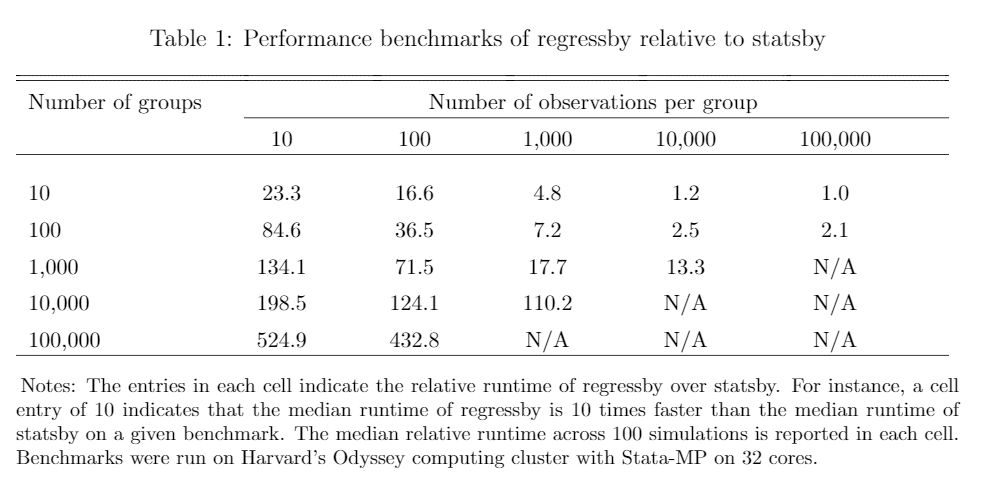

regressby
=================================

[Overview](#overview)
| [Motivation](#motivation)
| [Installation](#installation)
| [Usage](#usage)
| [Benchmarks](#benchmarks)
| [To-Do](#todo)
| [Acknowledgements](#acknowledgements)
| [License](#license)

Flexible and hyper-fast grouped regressions in Stata

`version 0.5 24jul2018`


Overview
---------------------------------

regressby is a fast and efficient method to run grouped OLS regressions; that is, it estimates a given OLS regression model on a collection of subsets of your dataset, returning the coefficients and standard errors associated with each regression. Functionally, it is very similar to the built-in -statsby- program, however, -regressby- runs between 10 and 1000 times faster than -statsby- in most use cases. The performance increases are particularly large when there are many groups, when the number observations in each group is relatively small, and when the regression model only contains a few parameters.

regressby supports a number of useful bells and whistles: subsetting with if/in, analytical weights, heteroskedasticity-robust and clustered standard errors. Furthermore, unlike statsby, regressby (optionally) allows users to access to the full variance-covariance matrix associated with each regression by returning the sampling covariance associated with each pair of estimated parameters.


Motivation
---------------------------------

It is easiest to describe how regressby functions by way of example. Suppose you want to estimate a regression describing the relationship between a person's income, y, and their parent's income, x. Also suppose that you have a variable g that describes each person's place of birth (say, each value of g represents a county in the United States), and you would like to obtain slopes and intercepts separately for each county in the United States (as in Chetty and Hendren, 2014). 

You can accomplish this in one step by regressing y on a vector of dummy variables for each distinct value of g and a vector of interactions between these dummies and x. This approach is convenient, but suffers from a number of drawacks. Most importantly, Stata does not allow the direct estimation of more than 10,998 parameters simultaneously, which in this case means that this one-step estimator can only be computed when there are fewer than 5,500 groups. Second, it turns out that directly estimating thousands of parameters is quite slow.

If the number of groups is relatively large, an alternative strategy is to estimate the regression model separately within each group. There are at least two easy ways to do this in Stata, either by manually iterating over groups or by using the built-in -statsby- function. Unfortunately, both of these methods are also excruciatingly slow when the number of groups is large.

Regressby is intended primarily as a replacement for -statsby-. In my use cases, this program has been hundreds of times faster than -statsby-, reducing the runtime of scripts that would previously take days or weeks into less than an hour.


Installation
---------------------------------

There are two options for installing regressby.

1. The most recent version can be installed from Github with the following Stata command:

```stata
net install regressby, from(https://raw.githubusercontent.com/mdroste/stata-regressby/master/)
```

2. A ZIP containing the program can be downloaded and manually placed on the user's adopath from Github.


Usage
---------------------------------

The following two commands are equivalent:

```stata
regressby y x, by(byvars)
statsby, by(byvars) clear: reg y x	
```

More on this soon. See the help file in Stata.


Benchmarks
---------------------------------



  
Todo
---------------------------------

The following items will be addressed soon:

- [ ] Finish off this readme.md
- [x] Provide a help file
- [ ] Finish benchmarking
- [ ] Provide script to validate results / example datasets

Porting this program into a compiled C plugin for Stata would yield a significant increase in performance; I have no plans to do that in the near future.


Acknowledgements
---------------------------------

This program is based off of internal code from the illustrious Michael Stepner's health inequality project. This program also benefited from contributions provided by the inimitable Dr. Wilbur Townsend, who helped elegantly generalize the code to allow for an arbitrary number of regressors. Finally, this program benefited greatly from the guidance and advice of Raj Chetty.


License
---------------------------------

regressby is [MIT-licensed](https://github.com/mdroste/stata-regressby/blob/master/LICENSE).

